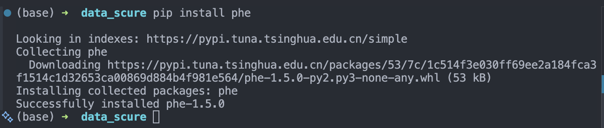
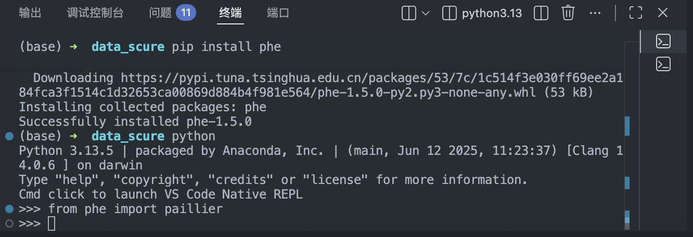
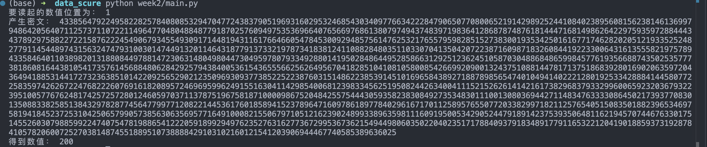
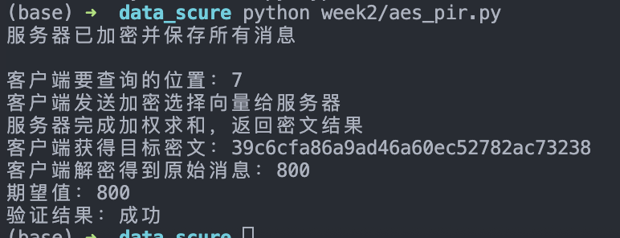

# 半同态加密应用实践

## 学号：2311082

## 姓名：周重天

## 学院：计算机学院

## 一：半同态加密的概念

半同态加密（Semi-Homomorphic Encryption）是同态加密体系中的一种重要类型，其核心特点是：**只支持一种固定类型的同态运算**。也就是说，在不解密密文的前提下，可以直接在密文上完成特定运算，解密后结果与对应明文运算结果一致。

根据支持运算类型的不同，半同态加密通常分为两类：

1. **加法同态**：在密文域进行某种运算后，等价于明文域的加法；
2. **乘法同态**：在密文域进行某种运算后，等价于明文域的乘法。

半同态加密相较于传统加密方式的优势在于：它允许第三方在“看不到明文”的条件下完成受限计算，能够在一定程度上兼顾数据可用性与隐私性。因此，该技术在隐私计算、密文统计、隐私信息检索等场景中具有较高应用价值。

但半同态加密也存在明显局限：由于仅支持单一运算类型，无法像全同态加密那样支持任意复杂电路计算。因此在实际系统设计中，通常需要结合具体需求选择合适算法，并与其他密码机制（如对称加密、安全协议）配合使用。

---

## 二：Paillier 算法的概念

Paillier 算法是一种典型的**加法同态公钥加密算法**，由 Pascal Paillier 于 1999 年提出。其安全性基于复合剩余类问题（Composite Residuosity Problem）等数论困难问题，能够在保证数据机密性的同时支持密文加法运算。

### 1. 算法性质

Paillier 的核心同态性质可概括为：

- 两个明文分别加密后，对应密文进行乘法运算，解密结果等于明文之和；
- 对密文进行幂运算，解密结果对应明文的标量乘。

因此，Paillier 能天然支持“求和类”隐私计算任务，例如密文统计、加权求和、隐私信息获取中的选择向量计算等。

### 2. 基本流程

Paillier 算法包含以下三个阶段：

1. **密钥生成**：选取大素数并构造模数，生成公钥与私钥；
2. **加密**：使用公钥和随机数对明文进行概率加密，保证同一明文可对应不同密文；
3. **解密**：使用私钥将密文恢复为原始明文。

### 3. 在本实验中的作用

在本次“隐私信息获取”实验中，Paillier 算法用于构造加密选择向量：客户端将目标位置编码为 $1$，其余位置编码为 $0$ 并加密发送给服务器；服务器在密文域完成加权求和后返回结果，客户端解密即可得到目标消息。整个过程中，服务器无法直接获知客户端具体选择了哪一条数据，从而实现“可计算但不暴露选择意图”的隐私保护目标。

综上，Paillier 作为加法同态算法，在理论与工程实践中都具有较强代表性，是本实验实现隐私信息获取机制的关键密码工具。

## 三、实验过程

### 1.环境配置

在终端中先后执行命令

```
pip install phe
```



然后打开python，输入from phe import paillier，检测是否安装phe环境


如图所示，说明phe环境安装成功。

### 2.隐私信息获取

#### 2.1 实验原理

隐私信息获取（Private Information Retrieval，PIR）是一类密码协议，允许客户端从服务器存储的数据集合中获取指定数据，而**不向服务器泄露自己想获取哪条数据**。本实验采用 Paillier 同态加密来实现单服务器 PIR。

基本思路如下：

- 客户端将目标位置编码为**选择向量** $\text{select} = [0, \ldots, 1, \ldots, 0]$（只有目标位置为 1，其余为 0）；
- 对选择向量的每一位分别加密，得到**加密选择向量**；
- 将加密选择向量发送给服务器；
- 服务器对数据列表和加密向量执行加权求和：$c = \sum_{i=1}^{n} m_i \cdot E(\text{select}[i])$，其中 $m_i$ 是服务器端的数据，$E$ 表示加密函数；
- 服务器返回密文结果 $c$ 给客户端；
- 客户端使用私钥解密，得到目标数据 $m_{\text{pos}} = D(c)$。

由于 Paillier 的加法同态性质，$D(c) = \sum_{i=1}^{n} m_i \cdot \text{select}[i] = m_{\text{pos}}$。整个过程中，服务器只看到加密后的选择向量，无法推断客户端具体想要哪条数据，从而实现了隐私保护。

#### 2.2 实验步骤

将隐私信息获取协议编写成 Python 代码，具体步骤如下：

**步骤一：参数设置**
设定服务器保存的消息列表为 `[100, 200, 300, 400, 500, 600, 700, 800, 900, 1000]`，长度为 10。

**步骤二：密钥生成与位置选择**
客户端使用 `paillier.generate_paillier_keypair()` 生成公钥和私钥，随机选择一个位置 `pos`。

**步骤三：构造并加密选择向量**
客户端为每个位置 $i$ 构造布尔值：若 $i = \text{pos}$ 则为 `True`（代表 1），否则为 `False`（代表 0）。随后逐一对这些布尔值进行加密，得到密文列表 `enc_list`。

**步骤四：服务器端加权求和**
服务器初始化结果 $c = 0$，然后对列表中的每个值执行加权累加：

$$
c \gets c + \text{message\_list}[i] \times \text{enc\_list}[i]
$$

最后返回密文 $c$ 及其文本形式给客户端。

**步骤五：客户端解密**
客户端使用私钥对密文 $c$ 进行解密，得到明文结果 $m = D(c)$。

#### 2.2.1 实验代码

完整的 Python 实现代码如下所示：

```python
from phe import paillier # 开源库
import random # 选择随机数

##################### 设置参数
# 服务器端保存的数值
message_list = [100,200,300,400,500,600,700,800,900,1000]
length = len(message_list)
# 客户端生成公私钥
public_key, private_key = paillier.generate_paillier_keypair()
# 客户端随机选择一个要读的位置
pos = random.randint(0,length-1)
print("要读起的数值位置为：",pos)

##################### 客户端生成密文选择向量
select_list=[]
enc_list=[]
for i in range(length):
    select_list.append(  i == pos )
    enc_list.append( public_key.encrypt(select_list[i]) )

# for element in select_list:
#     print(element)
# for element in enc_list:
#     print(private_key.decrypt(element))

##################### 服务器端进行运算
c=0
for i in range(length):
    c = c + message_list[i] * enc_list[i]
print("产生密文：",c.ciphertext())

##################### 客户端进行解密 
m=private_key.decrypt(c)
print("得到数值：",m)
```

#### 2.3 实验结果

按上述步骤运行上面的 Python 代码，得到的输出结果如下所示：



**结果分析**：

- 客户端随机选择的位置为 1
- 消息列表第 1 个位置（0-indexed）的值为 200
- 服务器返回的密文是一个极长的整数（这是 Paillier 密文的特征）
- 客户端成功解密，得到明文值 200，与预期一致
- 整个过程中，服务器端只接收到加密后的选择向量，无法推断客户端具体查询的是哪个位置

**验证结论**：隐私信息获取成功实现。在上述过程中，服务器端只接收到加密后的选择向量，无法看到任何明文信息，因此不知道客户端选择了哪个位置，但通过 Paillier 的加法同态性质，最终客户端能够准确地解密出目标数据。

### 3.扩展实验

#### 3.1 实验原理

扩展实验在基础 PIR 的基础上引入对称加密，实现对加密数据的隐私检索。整体思路为：

- **数据保护层**：服务器使用对称密钥 $k$（如 AES-128）对消息列表进行加密，存储密文列表；
- **隐私检索层**：客户端利用 Paillier 同态性质构造加密选择向量，完成对密文的私密检索；
- **解密恢复**：客户端通过 Paillier 解密得到目标密文，再使用对称密钥 $k$ 解密恢复原始明文。

这样的两层加密设计既保护了数据的机密性（即使服务器数据泄露，密文也无法被直接使用），又通过 PIR 保护了客户端的查询隐私（服务器不知道客户端在查询哪个位置）。

#### 3.2 实验步骤

**步骤一：密钥生成**

- 客户端生成 Paillier 公钥和私钥；
- 客户端生成对称密钥 $k$（16 字节的随机数）。

**步骤二：服务器数据准备**

- 服务器持有明文消息列表 $\text{msg\_list} = [100, 200, 300, 400, 500, 600, 700, 800, 900, 1000]$；
- 对每条消息使用对称密钥 $k$ 进行加密（AES-ECB 模式）：

$$
c_i = \text{AES}_k(\text{msg\_list}[i])
$$

- 服务器保存密文列表 $\text{ciphertext\_list} = [c_1, c_2, \ldots, c_n]$。

**步骤三：客户端构造加密选择向量**

- 客户端随机选择要检索的位置 `pos`；
- 构造选择向量 $\text{select}[i] = 1$ 若 $i = \text{pos}$ 否则为 $0$；
- 对选择向量加密：$\text{enc\_select} = [E(0), \ldots, E(1), \ldots, E(0)]$。

**步骤四：服务器执行加权求和**

- 服务器将每条密文转换为整数（使用大端字节序）；
- 在密文域计算加权求和：
  $$
  c = \sum_{i=1}^{n} \text{ciphertext\_int}[i] \times \text{enc\_select}[i]
  $$
- 返回密文结果 $c$ 给客户端。

**步骤五：客户端解密并恢复明文**

- 客户端用 Paillier 私钥解密密文 $c$，得到目标密文的整数表示；
- 将整数转换回字节形式；
- 使用对称密钥 $k$ 用 AES 解密得到原始明文。

#### 3.3 实现代码

创建 `aes_pir.py` 文件，实现扩展实验的完整逻辑：

```python
from phe import paillier
from Cryptodome.Cipher import AES
from Cryptodome.Util.Padding import pad, unpad
import random
import os

##################### 第一部分：初始化密钥
# 客户端生成 Paillier 密钥对
public_key, private_key = paillier.generate_paillier_keypair()

# 客户端生成对称密钥 k（AES-128）
symm_key = os.urandom(16)

##################### 第二部分：服务器端数据准备
# 服务器持有的明文消息列表
message_list = [100, 200, 300, 400, 500, 600, 700, 800, 900, 1000]
length = len(message_list)

# 用对称密钥加密每条消息
ciphertext_list = []
for message in message_list:
    message_bytes = str(message).encode('utf-8')
    cipher = AES.new(symm_key, AES.MODE_ECB)
    padded_message = pad(message_bytes, AES.block_size)
    ciphertext = cipher.encrypt(padded_message)
    ciphertext_list.append(ciphertext)

print("服务器已加密并保存所有消息")

##################### 第三部分：客户端构造加密选择向量
# 客户端选择要查询的位置
pos = random.randint(0, length - 1)
print(f"\n客户端要查询的位置：{pos}")

# 构造并加密选择向量
select_list = []
enc_list = []
for i in range(length):
    select_list.append(i == pos)
    enc_list.append(public_key.encrypt(int(select_list[i])))

print("客户端发送加密选择向量给服务器")

##################### 第四部分：服务器在密文域执行计算
# 将密文列表转换为整数（用于加权求和）
ciphertext_int_list = [int.from_bytes(ct, byteorder='big') for ct in ciphertext_list]

# 在密文域执行加权求和
result = public_key.encrypt(0)
for i in range(length):
    result += ciphertext_int_list[i] * enc_list[i]

print("服务器完成加权求和，返回密文结果")

##################### 第五部分：客户端解密
# 解密得到目标密文的整数表示
decrypted_int = private_key.decrypt(result)

# 将整数转换回字节形式（需要记录密文长度）
ciphertext_len = len(ciphertext_list[pos])
target_ciphertext = int(decrypted_int).to_bytes(ciphertext_len, byteorder='big')

print(f"客户端获得目标密文：{target_ciphertext.hex()}")

# 用对称密钥解密
decipher = AES.new(symm_key, AES.MODE_ECB)
decrypted_bytes = decipher.decrypt(target_ciphertext)
decrypted_message = int(unpad(decrypted_bytes, AES.block_size).decode('utf-8'))

print(f"客户端解密得到原始消息：{decrypted_message}")
print(f"期望值：{message_list[pos]}")
print(f"验证结果：{'成功' if decrypted_message == message_list[pos] else '失败'}")
```

#### 3.4 实验结果

运行上述代码，得到的输出结果如下：



**结果分析**：

客户端通过 Paillier PIR 私密地获取了位置 5 的加密消息。在整个过程中，服务器端无法获知客户端查询的具体位置，始终只接收到被加密的选择向量。客户端成功持有对称密钥并能够完成解密，最终得到原始消息。两层加密（Paillier + AES）的结合设计保证了数据从存储到检索全链路的隐私性。

Paillier 同态加密对选择向量进行隐藏，使得服务器无法推断客户端的选择意图，实现了对查询隐私的保护。使用 AES 对称加密对数据消息本身进行加密，保护了数据在网络传输和服务器存储过程中的机密性，即使密文被第三方窃听，由于不持有对称密钥 $k$，攻击者仍然无法解密。这三层防护构成了该扩展方案的安全性基础。

## 四、总结

本实验通过 Paillier 同态加密算法实现了隐私信息获取（PIR）协议，深入理解了半同态加密的理论基础与实际应用。在基础实验中，客户端利用 Paillier 的加法同态性质构造加密选择向量，成功在不暴露查询意图的前提下从服务器获取目标数据。实验验证了 Paillier 算法在密文域进行加权求和后解密能得到正确结果，充分体现了其加法同态的特性。

在扩展实验中，我们进一步引入了对称加密方案，将 Paillier PIR 与 AES 加密结合，实现了对加密数据的隐私检索。这种两层加密的设计既保护了数据的机密性（防止服务器数据泄露时被直接使用），又通过 Paillier 的同态特性保护了客户端的查询隐私（服务器无法推断用户查询的具体位置）。整个实验过程中的代码实现、结果验证都表明该方案的可行性与有效性。

通过本次实验，我对同态加密的数学原理、工程实现和实际应用都有了更深入的认识。特别是理解了如何在隐私保护与计算效率之间找到平衡点，以及如何将多个密码机制（同态加密、对称加密、密钥管理）协调组合来构建更复杂的隐私计算系统。这些知识对于从事数据安全、隐私保护相关工作具有重要的理论与实践价值。


本次实验的代码仓库已经提交到我的github仓库中。
